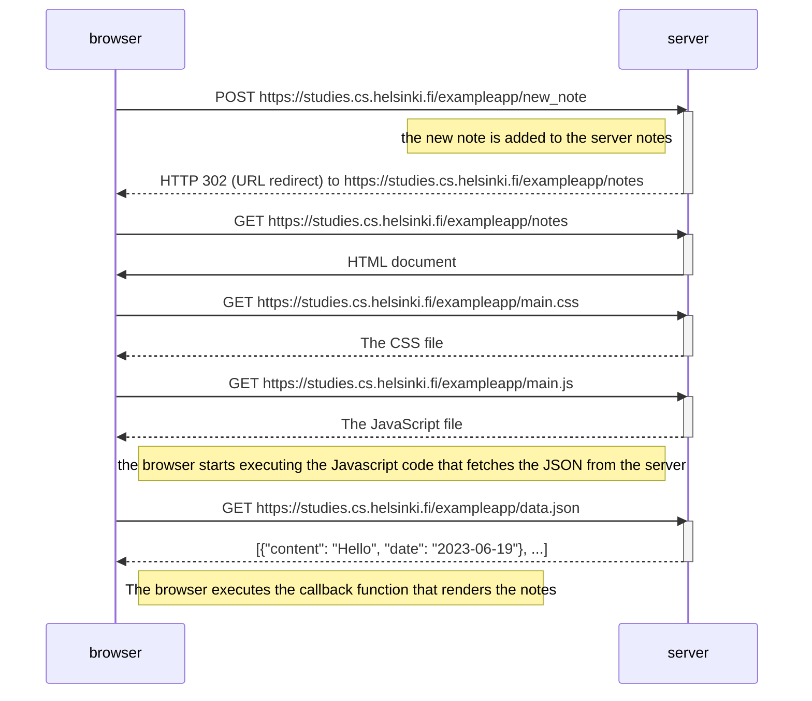

# Adding a new note

Diagram in which I'm trayting to explain the creation of a new note, extracted by [forms and http post](https://fullstackopen.com/en/part0/fundamentals_of_web_apps#forms-and-http-post).

