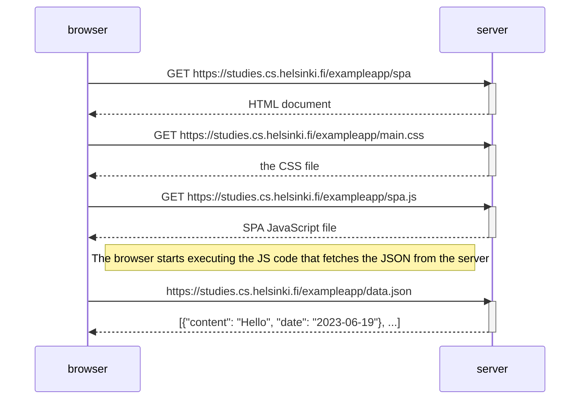

# Single App diagram

Diagram in which I'm trayting to explain the situation where the user goes into a single page app version of the notes app. Extracted from [forms and http post](https://fullstackopen.com/en/part0/fundamentals_of_web_apps#single-page-app).

