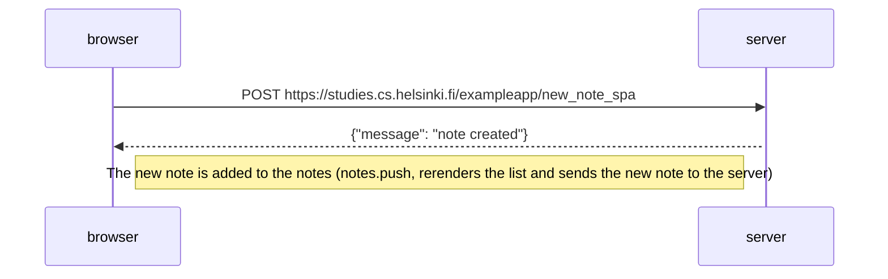

# New note in single page app

Diagram depicting the situation where the user creates a new note using the single page version of the app [SPA new note](https://studies.cs.helsinki.fi/exampleapp/spa).

